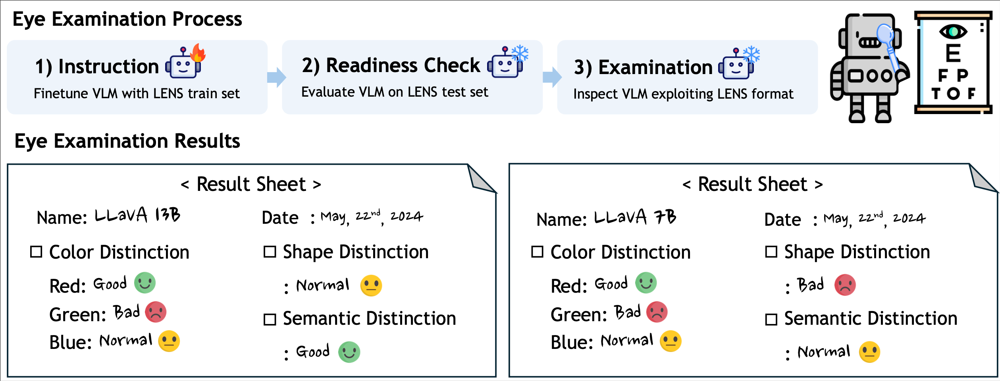

# VLM’s Eye Examination: Instruct and Inspect Visual Competency of Vision Language Model (TMLR submission)
 


Authors: [Nam Hyeon-Woo](https://sites.google.com/view/namhyeonwoo/), [Moon Ye-Bin](https://sites.google.com/g.postech.edu/moon-ye-bin), [Wonseok Choi](https://ami.postech.ac.kr/members/choi-wonseok), Lee Hyun, [Tae-Hyun Oh](https://ami.postech.ac.kr/)

> Abstract: Vision language models (VLMs) have shown promising reasoning capabilities across various benchmarks; however, our understanding of their visual perception remains limited. In this work, we propose an eye examination process to investigate how a VLM perceives images, focusing on key aspects of visual recognition, ranging from basic color and shape to semantic understanding. We introduce a dataset, LENS, to guide VLMs to follow the examination and check its readiness. Once the model is ready, we conduct the examination. We quantify and visualize VLMs' sensitivities to color and shape, and semantic matching. Our findings reveal that VLMs have varying sensitivity to different colors while consistently showing insensitivity to green across different VLMs. Also, we found different shape sensitivity and semantic recognition depending on LLM's capacity despite using the same fixed visual encoder. Our analyses and findings have the potential to inspire the design of VLMs and the pre-processing of visual input to VLMs for improving application performance.


# Environment (install each api or import from enrivonment.yaml)
- pip3 install torch torchvision torchaudio --index-url https://download.pytorch.org/whl/cu121
- conda install conda-forge::transformers
- pip install einops timm
- pip install 'accelerate>=0.26.0'
- conda install matplotlib
- pip install flash-attn --no-build-isolation
- pip install qwen-vl-utils
- conda install seaborn

# Dataset
1. Download [dataset](https://drive.google.com/file/d/1QkXsjoBBvYjrS9XiDq5LT34wLrrc6Zow/view?usp=sharing) 
2. unzip in this repo.

# Color Sensitivity
### Data structure
```
dataset/sensitivity
├── color-red
│       ├──── xxx.jpg
│
├── shape-green
│       ├──── xxx.jpg
│
├── shape-blue
│       ├──── xxx.jpg
```
### Run
```
python -m sensitivity.main --model_id [model id] --save_file [output path.json] --image_dir [image path]

example:
python -m sensitivity.main --model_id OpenGVLab/InternVL2_5-8B --save_file InternVL2_5-8B_red.json --image_dir dataset/sensitivity/color-red
```

[model id]
- OpenGVLab/InternVL2_5-1B
- OpenGVLab/InternVL2_5-2B
- OpenGVLab/InternVL2_5-4B
- OpenGVLab/InternVL2_5-8B

[dataset name]
- dataset/sensitivity/color-red
- dataset/sensitivity/color-blue
- dataset/sensitivity/color-green

# Shape Sensitivity
### Data structure
```
dataset/sensitivity
├── shape-eccentricity
│       ├──── xxx.jpg
│
├── shape-polygon
│       ├──── xxx.jpg
│
├── shape-size
│       ├──── xxx.jpg
```
### Run
1. Get the score from VLMs. We can get the json, csv, and txt files as results.
```
python -m sensitivity.main --model_id [model id] --save_file [save path] --image_dir [data path]

example:
python -m sensitivity.main --model_id OpenGVLab/InternVL2_5-8B --save_file InternVL2_5-8B_size.json --image_dir dataset/sensitivity/shape-size
python -m sensitivity.main --model_id OpenGVLab/InternVL2_5-4B --save_file InternVL2_5-4B_size.json --image_dir dataset/sensitivity/shape-size
```
2. Get the plot from two csv files from first step. We can get the plot as pdf format.
```
python -m sensitivity.plot --csv_file1 InternVL2_5-4B_size.csv --csv_file2 InternVL2_5-8B_size.csv --label1 4B --label2 8B --save_file InternVL2_5-4B_8B_size.pdf
```


# Evaluation
``` 
python -m evaluate.main --model_id [model id] --image_dir data_folder [dataset name] --image_json test.json

example:
python -m evaluate.main --model_id OpenGVLab/InternVL2_5-8B --image_dir dataset/colors/yes_or_no/ --image_json test.json
python -m evaluate.main --model_id OpenGVLab/InternVL2_5-8B --image_dir dataset/colors/1_or_2/ --image_json test.json
python -m evaluate.main --model_id OpenGVLab/InternVL2_5-8B --image_dir dataset/shapes/yes_or_no/ --image_json test.json
python -m evaluate.main --model_id OpenGVLab/InternVL2_5-8B --image_dir dataset/shapes/1_or_2/ --image_json test.json
```
[model id]
 - OpenGVLab/InternVL2_5-1B
 - OpenGVLab/InternVL2_5-2B
 - OpenGVLab/InternVL2_5-4B
 - OpenGVLab/InternVL2_5-8B

[dataset name]
 - colors/yes_or_no/
 - colors/1_or_2/
 - shapes/yes_or_no/
 - shapes/1_or_2/
